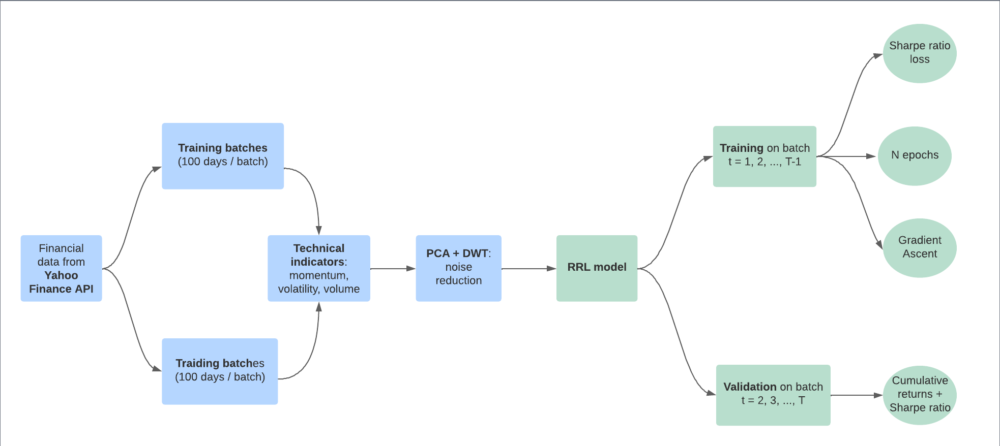
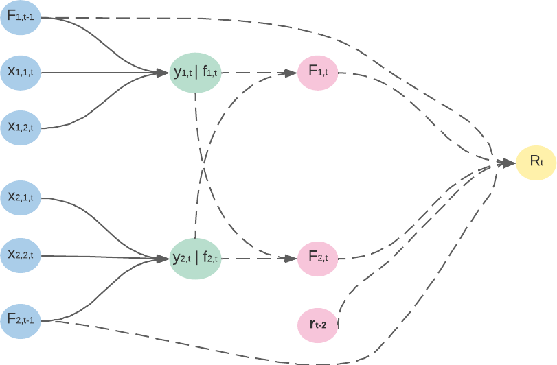
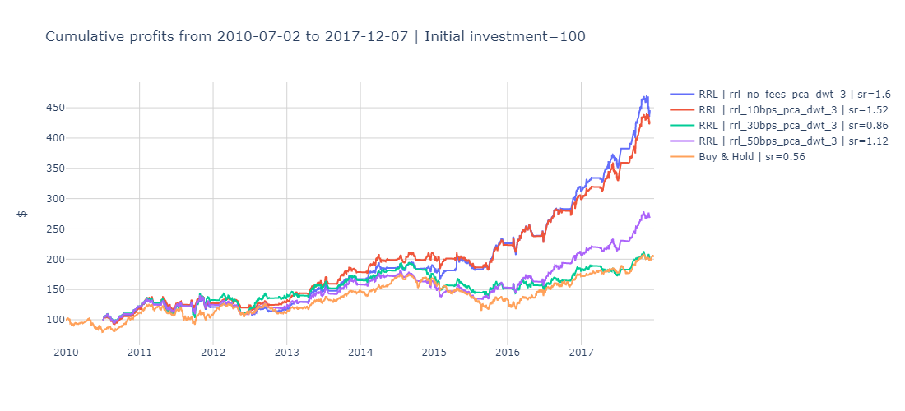

#  An Automated Portfolio Trading System with Feature

## Objective 

Inspired by the article entitled [An Automated Portfolio Trading System with Feature Preprocessing and Recurrent Reinforcement Learning](https://paperswithcode.com/paper/an-automated-portfolio-trading-system-with) written by Lin Li, we aim at implementing a fully automated trading system which incorporates a portfolio weight rebalance function and handles multiple assets. The trading bot is based on recurrent reinforcement learning and is developed in `python`. 

## Conceptual framework

The below schema briefly depicts the two main parts of the trading bot namely the data preprocessing layers and the recurrent reinforcement learning (RRL) model. The following sections give more details about each step used to build the bot, as well as the results obtained during backtests.

## Data 

In this part, we explain the data source used to realize the project and the preprocessing steps that are implemented to remove the noise in the raw data and uncover the general pattern underlying the financial data set.

### Configuration

#### Yahoo Finance data

Since the trading system is supposed to run continuously on daily data, the [`yfinance`](https://pypi.org/project/yfinance/) library is useful to retrieve accurate financial data on multiple stocks. It is an open-source tool that uses Yahoo's publicly available APIs, and is intended for research and educational purposes.

#### Assets

As in the Lin Li's article, we used the 8 subsequent financial assets as input in the RRL trading system. These stocks are listed in the S&P500 index which is representative of the general stock market condition in
the US. When downloading the data from Yahoo Finance, Open, High, Low, Close and Volume are returned for each stock. The study is realised between 2009/12/31 and 2017/12/29. 

|  Ticker | Company  |
|---|---|
| XOM | Exxon Mobil Corporation |
| VZ | Verizon Communications Inc. |
| NKE | Nike, Inc. |
| AMAT | Applied Materials, Inc. |
| MCD | McDonald's Corporation |
| MSFT | Microsoft Corporation |
| AAP | Advance Auto Parts, Inc. |
| NOV | Nov, Inc. |

#### Technical indicators

Technical indicators are heuristic or pattern-based signals produced by the price, volume, and/or open interest of a security or contract used by traders who follow technical analysis. In other words, they summarize the general pattern of the time series. While 4 groups of technical indicators are mentioned in the article, we solely use 3 types as depicted in the following table.

|  Momentum | Volatility  | Volume |
|---|---|---|
| Momentum (MOM)  | Average True Range (ATR) | Chaikin Oscillator (CO) |
| Moving Average Convergence Divergence (MACD) | Normalized Average True Range (NATR) | On Balance Volume (OBV) |
| Money Flow Index (MFI) | | |
| Relative Strength Index (RSI) | | |

Both the [`ta`](https://pypi.org/project/ta/) and [`TA-Lib`](https://mrjbq7.github.io/ta-lib/) Python libraries are leveraged to compute the indicators without much difficulty. 

We note $\mathcal{T}$ the set of technical indicators such that $|\mathcal{T}| = 8$.

#### Normalization 

To avoid scaling issues, each technical indicator feature is normalized using the z-score: 

$$
X' = \frac{X - \bar{X}}{s_X}
$$

where $\bar{X}$ is the mean and $s_X$ the standard deviation. 

### Dimension reduction and signal processing

One of the main stake that arise when training a machine learning model, is the agent's ability to generalize on unseen data. In other words the ML agent needs to learn the general pattern of the data, and noise has to be removed. 

#### Principal Component Analysis (PCA)

PCA is the first technique used in the preprocessing layer and aims at reducing the dimension of the input data. To that end, PCA identifies principal axes that represent the directions of maximum variance of the input. In our project, the normalized indicators in $\mathcal{T}$ are decomposed by PCA such that the sum of the variance explained by principal components explains at least 95% of the total variance. We thus obtain a new set of features $\mathcal{T}' \subset \mathcal{T}$, with $|\mathcal{T}'| < 8$. The [`sklearn`](https://scikit-learn.org/stable/) library is used to implement PCA.

#### Discrete Wavelet Transform (DWT)

ALthough PCA is a powerful technique for dimension reduction, some local noise may persist in the training data. Consequently, the DWT method is applied on the principal components in $\mathcal{T}'$. First, the input data is decomposed into several coefficients so as to separate the general trend of the signal from the local noise. Then, we apply soft thresolding technique on the coefficients. Finally, the denoised version of the original signal is obtained with the inverse DWT method. The [`PyWavelets `](https://pywavelets.readthedocs.io/en/latest/) is used to implement Discrete Wavelet Transform. 

### Train / trading split 

As shown by the conceptual schema, the data is divided into training and trading (validation) batches of length $T=100$ days which are defined as folllows: 

$$
\begin{align*}
\mathcal{B}_{\text{train}} & = \big\{ (X_b, \mathrm{y}_b) \big\}_{b=1}^{T-1} \\\\
\mathcal{B}_{\text{val}} & = \big\{ (X_b, \mathrm{y}_b) \big\}_{b=2}^{T}
\end{align*}
$$

where $X_b$ is the transformed feature matrix and $\mathrm{y}_b$ the target variable vector. 

It is relevant to note that normalization and PCA are only fitted on the training batches and the technical indicators are calculated on each batch separately. The idea behind this is to ensure that the model's performance is an accurate reflection of its ability to generalize to new data.  

## The RRL model

Once the data fully prepreocessed and the training and trading batches created, the recurrent reinforcement lerning model can start its learning process. 

### Objective

Based on the preprocessed technical indicators, the RRL agent aims at rebalancing the portfolio which is composed of $m$ assets with corresponding weights, denoted 

$$\pmb{F}_t = (F_{1,t}, \dots, F_{m,t})^{'}$$

$\pmb{F}_t$ is updated at each period with a view to maximize Sharpe ratio defined as: 

$$
S_T = \frac{A}{\sqrt{B - A^2}} \quad \text{where } 
\begin{cases} 
    A = \frac{1}{T} \sum_{t=1}^T R_t \\\\
    B = \frac{1}{T} \sum_{t=1}^T R_t^2
\end{cases}
$$

Given $\pmb{r}_t$ the vector of assets' returns, $\delta$ the transaction fees and $e=(1, \dots, 1)'$, the portfolio return at time $t$ is:

$$
R_t = (1 + \pmb{F}_{t-3}'\pmb{r}_{t})(1 - \delta \times e^{'}|F_{t-2} - F_{t-3}|) - 1
$$

Note we use positions computed at time $t-2$ to obtain returns at time $t$ since there is a usual 2-day delay when implementing daily trading strategies in practice. In the case where the positions are the same from time $t-3$ to time $t-2$, the $\delta$ term disappears from the formula.

### Architecture

### Training 

### Validation / Trading

## Backtest

