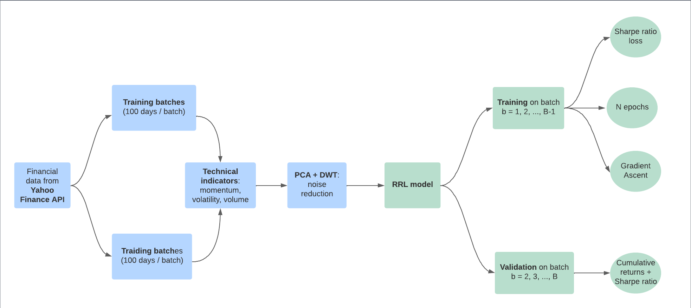

#  An Automated Portfolio Trading System with Feature

## Objective 

Inspired by the article entitled [An Automated Portfolio Trading System with Feature Preprocessing and Recurrent Reinforcement Learning](https://paperswithcode.com/paper/an-automated-portfolio-trading-system-with) written by Lin Li, we aim at implementing a fully automated trading system which incorporates a portfolio weight rebalance function and handles multiple assets. The trading bot is based on recurrent reinforcement learning and is developed in `python`. 

## Conceptual framework

The below schema briefly depicts the two main parts of the trading bot namely the data preprocessing layers and the recurrent reinforcement learning (RRL) model. The following sections give more details about each step used to build the bot, as well as the results obtained during backtests.

## Data 

In this part, we explain the data source used to realize the project and the preprocessing steps that are implemented to remove the noise in the raw data and uncover the general pattern underlying the financial data set.

### Yahoo Finance data

Since the trading system is supposed to run continuously on daily data, the [`yfinance`](https://pypi.org/project/yfinance/) library is useful to retrieve accurate financial data on multiple stocks. It is an open-source tool that uses Yahoo's publicly available APIs, and is intended for research and educational purposes.

### Assets

As in the Lin Li's article, we used the 8 subsequent financial assets as input in the RRL trading system. These stocks are listed in the S&P500 index which is representative of the general stock market condition in
the US. When downloading the data from Yahoo Finance, Open, High, Low, Close and Volume are returned for each stock. The study is realised between 2009/12/31 and 2017/12/29. 

|  Ticker | Company  |
|---|---|
| XOM | Exxon Mobil Corporation |
| VZ | Verizon Communications Inc. |
| NKE | Nike, Inc. |
| AMAT | Applied Materials, Inc. |
| MCD | McDonald's Corporation |
| MSFT | Microsoft Corporation |
| AAP | Advance Auto Parts, Inc. |
| NOV | Nov, Inc. |

### Technical indicators

Technical indicators are heuristic or pattern-based signals produced by the price, volume, and/or open interest of a security or contract used by traders who follow technical analysis. In other words, they summarize the general pattern of the time series. While 4 groups of technical indicators are mentioned in the article, we solely use 3 types as depicted in the following table.

|  Momentum | Volatility  | Volume |
|---|---|---|
| Momentum (MOM)  | Average True Range (ATR) | Chaikin Oscillator (CO) |
| Moving Average Convergence Divergence (MACD) | Normalized Average True Range (NATR) | On Balance Volume (OBV) |
| Money Flow Index (MFI) | | |
| Relative Strength Index (RSI) | | |

Both the [`ta`](https://pypi.org/project/ta/) and [`TA-Lib`](https://mrjbq7.github.io/ta-lib/) Python libraries are leveraged to compute the indicators without much difficulty. 

We note $\mathcal{T}$ the set of technical indicators. 

## The RRL model
