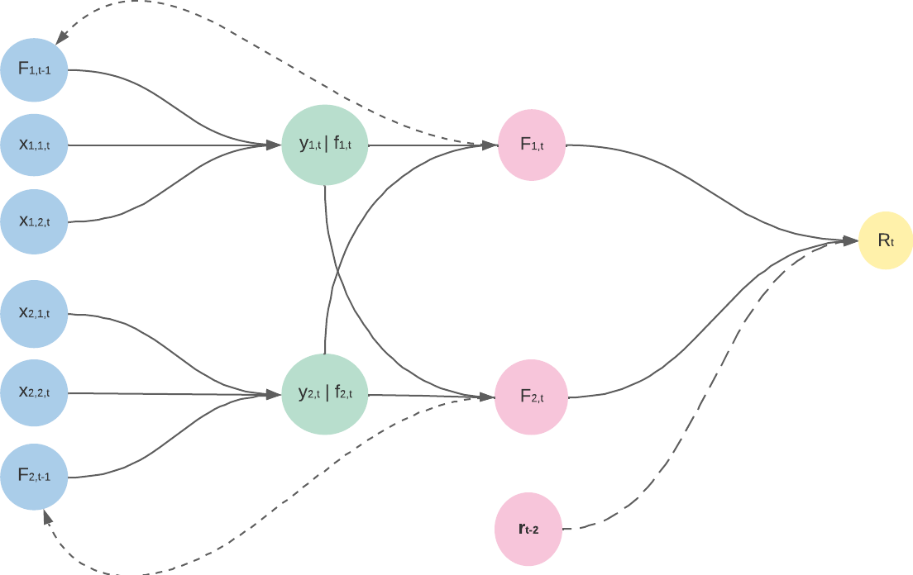

#  An Automated Portfolio Trading System with Feature

## Objective 

Inspired by the article entitled [An Automated Portfolio Trading System with Feature Preprocessing and Recurrent Reinforcement Learning](https://paperswithcode.com/paper/an-automated-portfolio-trading-system-with) written by Lin Li, we aim at implementing a fully automated trading system which incorporates a portfolio weight rebalance function and handles multiple assets. The trading bot is based on recurrent reinforcement learning (RRL). 

## `rrl_trading`

To implement the article, a Python library named `rrl_trading` has been developed. It consists in 4 main sub-modules which are introduced below: 

| Module | Description   |
|---|---|
| [`data`](rrl_trading/data/)  |  Data collection, indicators, preprocessing (PCA, DWT) |
| [`model`](rrl_trading/model/) | RRL model, training, validation   |
| [`metrics`](rrl_trading) | Cumulative returns/profits, Sharpe ratio   |
| [`backtest`](rrl_trading/backtest/) | Run RRL strategy, visualisation |

## Conceptual framework

The below schema briefly depicts the two main parts of the trading bot namely the data preprocessing layer as well as the recurrent reinforcement learning model, its training and validation process. The following sections give more details about each step used to build the bot, as well as the results obtained during backtests.

<figure>

<figcaption><i><u>Conceptual schema of the RRL-PCA-DWT trading system</u></i></figcaption>
</figure>

## Data 

In this part, we explain the data source used to realize the project and the preprocessing steps that are implemented to remove the noise in the raw data and uncover the general pattern underlying the financial data set.

### Configuration

#### Yahoo Finance data

Since the trading system is supposed to run continuously on daily data, the [`yfinance`](https://pypi.org/project/yfinance/) library is useful to retrieve accurate financial data on multiple stocks. It is an open-source tool that uses Yahoo Finance's publicly available APIs, and is intended for research and educational purposes.

#### Assets

As in Lin Li's article, we used the 8 subsequent financial assets as input in the RRL trading system. These stocks are listed in the S&P500 index which is representative of the general stock market condition in the US. When downloading the data from Yahoo Finance, Open, High, Low, Close and Volume are returned for each stock. The study is realised between 2009/12/31 and 2017/12/29. 

|  Ticker | Company  |
|---|---|
| XOM | Exxon Mobil Corporation |
| VZ | Verizon Communications Inc. |
| NKE | Nike, Inc. |
| AMAT | Applied Materials, Inc. |
| MCD | McDonald's Corporation |
| MSFT | Microsoft Corporation |
| AAP | Advance Auto Parts, Inc. |
| NOV | Nov, Inc. |

### Technical indicators

Technical indicators are heuristic or pattern-based signals produced by the price, volume, and/or open interest of a security or contract used by traders who follow technical analysis. In other words, they summarize the general pattern of the financial time series. While 4 groups of technical indicators are mentioned in the article, we solely use 3 types as depicted in the following table. Cycle indicators indeed decreased the performance of the RRL trading system.

|  Momentum | Volatility  | Volume |
|---|---|---|
| Momentum (MOM)  | Average True Range (ATR) | Chaikin Oscillator (CO) |
| Moving Average Convergence Divergence (MACD) | Normalized Average True Range (NATR) | On Balance Volume (OBV) |
| Money Flow Index (MFI) | | |
| Relative Strength Index (RSI) | | |

Both the [`ta`](https://pypi.org/project/ta/) and [`TA-Lib`](https://mrjbq7.github.io/ta-lib/) Python libraries are leveraged to compute the indicators without much difficulty. 

We note $\mathcal{T}$ the set of technical indicators such that $|\mathcal{T}| = 8$.

#### Normalization 

To avoid scaling issues, each technical indicator feature is normalized using the z-score: 

$$
X' = \frac{X - \bar{X}}{s_X}
$$

where $\bar{X}$ is the mean and $s_X$ the standard deviation of the series $X$.

### Dimension reduction and signal processing

One of the main stake that arise when training a machine learning model, is the agent's ability to generalize on unseen data. In other words the ML agent needs to learn the general pattern of the data, and noise has to be removed. 

#### Principal Component Analysis (PCA)

PCA is the first technique used in the preprocessing layer and aims at reducing the dimension of the input data. To that end, PCA identifies principal axes that represent the directions of maximum variance of the input. In our project, the normalized indicators in $\mathcal{T}$ are decomposed by PCA such that the sum of the variance explained by principal components explains at least 95% of the total variance. We thus obtain a new set of features $\mathcal{T}' \subset \mathcal{T}$, with $|\mathcal{T}'| < 8$. 

The [`sklearn`](https://scikit-learn.org/stable/) library is used to implement PCA.

#### Discrete Wavelet Transform (DWT)

Although PCA is a powerful technique for dimension reduction, some local noise may persist in the reduced data. Consequently, the DWT method is applied on the principal components in $\mathcal{T}'$. First, the input data is decomposed into several coefficients so as to separate the general trend of the signal from the local noise. Then, we apply soft thresolding technique on the coefficients. Finally, the denoised version of the original signal is obtained with the inverse DWT method. 

The [`PyWavelets`](https://pywavelets.readthedocs.io/en/latest/) is used to implement Discrete Wavelet Transform. 

### Train / trading split 

As shown by the conceptual schema, the data is divided into training and trading (validation) batches of length $T=100$ days which are defined as folllows: 

$$
\begin{align*}
\mathcal{B}_{\text{train}} & = \{ (X_b, \mathrm{r}_b) \}_{b=1}^{B-1} \\\\
\mathcal{B}_{\text{val}} & = \{ (X_b, \mathrm{r}_b) \}_{b=2}^{B}
\end{align*}
$$

where $X_b$ is the transformed feature matrix and $\mathrm{y}_b$ is the matrix of returns related to days in the $b$-th batch. $B$ is the number of 100-day batches.

It is relevant to note that normalization and PCA are only fitted on the training batches and the technical indicators are calculated on each batch separately. The idea behind this is to ensure that the model's performance is an accurate reflection of its ability to generalize to new data. 

### Dataset creation

The [`data`](rrl_trading/data/) module from the `rrl_trading` library contains a dataclass named [`Data`](rrl_trading/data/dataset.py) which helps the user creating the dataset easily. This dataclass incorporates all necessary methods to split the data into batches, compute indicators and apply the PCA & DWT transformations. 

## The RRL model

Once the data fully prepreocessed and the training and trading batches created, the recurrent reinforcement lerning model can start its learning process. 

### Objective function

Based on the preprocessed technical indicators, the RRL agent aims at rebalancing the portfolio which is composed of $m$ assets with corresponding weights, denoted 

$$\mathrm{F}_t = [F_{1,t}, \dots, F_{m,t}]^{'}$$

$\mathrm{F}_t$ is updated at each period with a view to maximize Sharpe ratio defined as: 

$$
S_T = \frac{A}{\sqrt{B - A^2}} 
$$

where, 

$$
A = \frac{1}{T} \sum_{t=1}^T R_t \quad ; \quad  B = \frac{1}{T} \sum_{t=1}^T R_t^2
$$

Given $\mathrm{r}_t$ the vector of assets' returns, $\delta$ the transaction fees and $\mathrm{e}_m=(1, \dots, 1)'$, the portfolio return at time $t$ is:

$$
R_t = (1 + \mathrm{F}_{t-3}^{'}\mathrm{r}_{t})(1 - \delta \cdot \mathrm{e}_m^{'}|F_{t-2} - F_{t-3}|) - 1 \quad \text{where } \mathrm{r}_t = (r_{1, t}, \dots, r_{m, t})^{'}
$$

Note we use positions computed at time $t-2$ to obtain returns at time $t$ since there is a usual 2-day delay when implementing daily trading strategies in practice. In the case where the positions are the same from time $t-3$ to time $t-2$, the $\delta$ term disappears from the formula.

### Architecture

Let us note $\Theta = [\pmb{\theta}_1, \dots, \pmb{\theta}_m]^{'}$ the system parameter matrix to be learned during the training process, where $\pmb{\theta}_i$ is a $(n+2) \times 1$ matrix. $n$ is the number of features and two more coefficients are added to take bias and previous asset's weight in the portfolio. 

The feature matrix is defined as:

$$
X_t = [\mathrm{x}_{1, t}, \dots, \mathrm{x}_{m,t}]^{'} \quad \text{such that } \mathrm{x}_{i, t} = [1, x_{i, 1, t}, \dots, x_{i, n, t}, F_{i, t-1}]
$$ 

Note that $x_{i, j, t}$ is the $j$-th preprocessed technical indicator value at time $t$ and $F_{i, t-1}$ the portfolio weight at time $t-1$ for asset $i$. 

The hidden values computed at time $t$ are stored into the $m \times 1$ matrix $Y_t=[y_{1, t}, \dots, y_{m, t}]^{'}$ such that: 

$$
Y_t =  (X_t \otimes \Theta) \cdot \mathrm{e}_m
$$

where $\otimes$ is the element-wise product between matrices.

We then use the hyperbolic tangent activation function such that: 

$$
\mathrm{f}_t = [f_{1, t}, \dots, f_{m, t}]^{'} = \text{tanh}(Y_t)
$$

Finally, we use the softmax function to normalize the outputs and obtain portfolio weights at time $t$: 

$$
\mathrm{F}_t = \frac{\exp(\mathrm{f}_t)}{\mathrm{e}_m^{'} \cdot \exp(\mathrm{f}_t)}
$$

The sum of porftoflio weights at time $t$ is thus equal to 1 ie $\mathrm{F}_t^{'} \cdot \mathrm{e}_m = 1$.  

The following schema is a simplified version of the shallow neural network used to build the trading system. Here, the portfolio is made up of 2 assets and there are 2 preprocessed features to learn the optimal portfolio weights. The dotted lines illustrate the network's recursive pattern. The dashed line stands for the assets' returns at time time $t-2$ that are used to derive portfolio return.

<figure>

<figcaption><i><u>Simplified architecture of the RRL model</u></i></figcaption>
</figure>

### Model implementation

The [`model`](rrl_trading/model/) sub-module from the `rrl_trading` library implements a python version of the RRL model through the [`RRL`](rrl_trading/model/rrl.py) class. The latter incorporates forward pass, backpropagation and computes portfolio returns for a given portfolio allocation.

### Training 

When training the PCA-DWT-RRL trading agent, the objective function needs to be maximized as it is the Sharpe ratio. To that end, the network's parameters are updated based on the gradient ascent rule. The following image shows the training process for one batch over $n$ epochs. Keep in mind that once the model trained on batch $b$, its performance is evaluated on batch $b+1$ in order to test its consistency. This learning/validation method is repeated until the last set of training/trading batch.

<figure>

<figcaption><i><u>Algorithm used to train the RRL model</u></i></figcaption>
</figure>

 

More details on backpropagation can be found in the original [article](https://paperswithcode.com/paper/an-automated-portfolio-trading-system-with). 

The methods developed in the [`optimize`](rrl_trading/model/optimize.py) sub-module from the `rrl_trading` library are used to train the RRL agent. 

## Backtest

This final section presents backtesting results of different strategies based on the RRL trading system. The benchmark is the "Buy & hold" strategy in which the investor buy the stock at the begining of the trading period and sells at the end.

### Comparison of multiple startegies

Emphasis is placed on comparing cumulative profits and annualized sharpe ratio for trading strategies implemented on different preprocessed data. We set the transaction fees to 30 bps which is $\approx$ 0.003. 

It can be noted that the best performance is obtained when we solely apply the Discrete Wavelet Transform in the preprocessing layer (RRL-DWT). The sharpe ratio is higher for the RRL-PCA-DWT and RRL-DWT strategies than for the "Buy & hold" benchmark. The two other RRL-based strategies perform poorly. 

<figure>

</figure>

Note the above graph has been obtained using the [`plot_cumulative_profits()`](rrl_trading/backtest/plots.py) function from the [`backtest`](rrl_trading/backtest/) sub-module. 

### Analysis of the RRL-DWT strategy with fees=30 bps

The [`backtest`](rrl_trading/backtest/) sub-module gives investors key insights about a specific startegy.

On the one hand, one can get a dynamic visualisation of cumulative returns at the end of each trading window using the [`make_cumrets_barplot()`](rrl_trading/backtest/plots.py) function. The first plot indicates the RRL-DWT strategy obtain quite satisfying results over the different trading batches as only 3 of them get negative cumulative returns. 

On the other hand, the [`plot_avg_portfolio_allocation()`](rrl_trading/backtest/plots.py) function shows the average portfolio allocation over trading windows which is useful to identify the assets favored by the trading agent. 

  
   

### Best strategy

From the above pie chart, it can be noticed that AMAT, MSFT, MCD  and AAP accounts for more than 60% of the portfolio optimized by the trading agent. It seems interesting to run another RRL-DWT strategy with these 4 assets only. 

<figure>

</figure>

Here, the trading system's decisions seem to be efficient when fees are not too high.